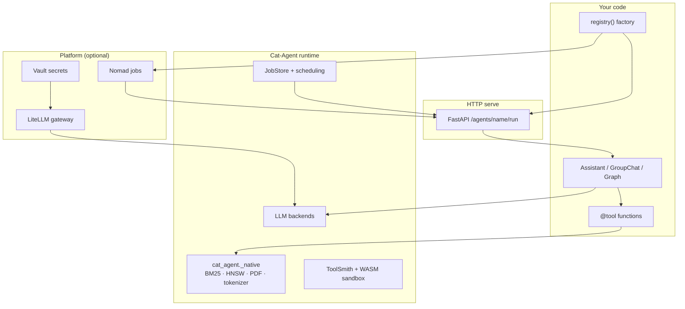
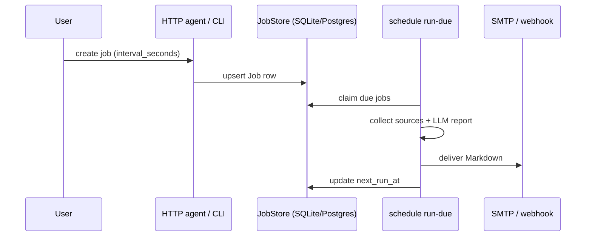

# Cat-Agent

<div align="center">


**On-premise, sandboxed AI agent platform for regulated sectors**

Public sector, finance, and healthcare — where data must stay on your infrastructure.

[](https://pypi.org/project/cat-agent/)
[](https://opensource.org/licenses/Apache-2.0)
[](https://www.python.org/)

</div>

---

## What is Cat-Agent?

Cat-Agent is a **Python framework** for building LLM agents that run fully on-premise. You get:

- **Agents** — `Assistant`, multi-agent `GroupChat`, graph workflows (`StateGraph`)
- **Tools** — `@tool` decorator, RAG, code interpreter (Docker or WASM), MCP
- **Serve & deploy** — FastAPI HTTP server + Nomad deploy via `cat-agent deploy`
- **Scheduling** — recurring collect-and-report jobs (email / webhook)
- **Synthesis** — Markdown draft → interviewed spec → sandboxed `@tool`
- **Security** — air-gap mode, encrypted storage, audit trail, PII redaction

The base install is lightweight (OpenAI-compatible client + native Rust RAG). Heavy backends (Transformers, LlamaCpp, MLX) are optional extras.

---

## Table of contents

1. [Zero to hero](#zero-to-hero)
2. [Architecture](#architecture)
3. [Installation](#installation)
4. [Configuration](#configuration)
5. [Core concepts](#core-concepts)
6. [CLI reference](#cli-reference)
7. [Deploy to Nomad](#deploy-to-nomad)
8. [Scheduled reports](#scheduled-reports)
9. [Tool synthesis](#tool-synthesis)
10. [Security & compliance](#security--compliance)
11. [Advanced topics](#advanced-topics)
12. [Examples index](#examples-index)
13. [Development](#development)

---

## Zero to hero

Follow this path in order. Each step links to a runnable example in `examples/`.

| Step | Goal | Command / example |
| --- | --- | --- |
| **0** | Clone & configure | `cp .env.example .env` |
| **1** | Install | `pip install cat-agent` |
| **2** | First agent | [2.1 API](#step-21--api-openai-compatible) · [2.2 Transformers](#step-22--transformers) · [2.3 LlamaCpp](#step-23--llamacpp) · [2.4 MLX](#step-24--mlx-apple-silicon) |
| **3** | HTTP serve | [`examples/serve_fastapi/`](examples/serve_fastapi/) |
| **4** | Nomad deploy | [`cat-agent-stack`](https://github.com/kemalcanbora/cat-agent-stack) + `cat-agent deploy` |
| **5** | Multi-agent team | [`examples/multi_agent/`](examples/multi_agent/) |
| **6** | Scheduled reports | [`examples/scheduling/`](examples/scheduling/) |
| **7** | Tool synthesis | [`examples/synthesis/from_draft/`](examples/synthesis/from_draft/) |
| **8** | Production hardening | [Security & compliance](#security--compliance) |

### Step 0 — Environment

```bash
git clone https://github.com/kemalcanbora/cat-agent.git
cd cat-agent
cp .env.example .env
# Edit .env — at minimum set your LLM gateway or Ollama credentials
```

Cat-Agent loads `.env` automatically on `import cat_agent` and when using the CLI. Shell exports override file values. Point elsewhere with `CAT_AGENT_ENV_FILE=/path/to/custom.env`.

### Step 1 — Install

Requires **Python 3.10+**. On zsh, quote extras:

```bash
pip install cat-agent                  # base: agents, tools, native RAG
pip install 'cat-agent[serve]'           # FastAPI HTTP server
pip install 'cat-agent[platform]'        # Nomad deploy
pip install 'cat-agent[scheduler]'       # scheduled reports
pip install 'cat-agent[rag]'             # doc parsing + ONNX embeddings
pip install 'cat-agent[local]'           # transformers + llama + wasm
pip install 'cat-agent[all]'             # everything
```

### Step 2 — Your first agent

Every backend uses the same pattern: define a `@tool`, attach it to `Assistant`, call `run`. Pick the LLM that matches your hardware.

#### Step 2.1 — API (OpenAI-compatible)

Works with OpenAI, Ollama Cloud, or any on-prem gateway. No extra install beyond `cat-agent`.

```python
from cat_agent.agents import Assistant
from cat_agent.tools import tool

@tool
def sum_two_number(a: float, b: float) -> float:
    """Adds two numbers."""
    return a + b

bot = Assistant(
    llm={'model': 'gpt-4o-mini', 'model_type': 'oai', 'model_server': 'https://api.openai.com/v1'},
    function_list=[sum_two_number],
)
print(list(bot.run([{'role': 'user', 'content': 'What is 2 + 3?'}]))[-1]['content'])
```

```bash
# Ollama Cloud — set OLLAMA_API_KEY + OLLAMA_API_BASE in .env
python examples/tool_decorator/sum_two_number.py
python examples/multi_agent/team_example.py      # three models on one gateway
```

**Nomad-deployable** when paired with `agent.yaml` (`model.type: api`). See Step 4.

#### Step 2.2 — Transformers (HuggingFace / GPU)

Local PyTorch models — CUDA or Apple MPS.

```bash
pip install 'cat-agent[transformers]'
python examples/transformers_math_guy/math_guy.py
```

```python
bot = Assistant(
    llm={
        'model': 'Qwen/Qwen3.5-0.8B',
        'model_type': 'transformers',
        'device': 'cuda:0',   # or 'mps' on Mac
    },
    function_list=['sum_numbers'],
)
```

Local-only — no `agent.yaml` / Nomad deploy (model weights live on your machine).

#### Step 2.3 — LlamaCpp (GGUF)

Quantised GGUF models via `llama-cpp-python`. CPU or GPU offload.

```bash
pip install 'cat-agent[llama]'
python examples/llama_cpp_math_guy/llama_cpp_example.py

# HTTP serve (still local-only — no agent.yaml):
cat-agent serve --factory llama_cpp_example:registry
```

```python
bot = Assistant(
    llm={
        'model_type': 'llama_cpp',
        'repo_id': 'Salesforce/xLAM-2-3b-fc-r-gguf',
        'filename': 'xLAM-2-3B-fc-r-F16.gguf',
        'n_gpu_layers': -1,
    },
    function_list=['sum_two_number'],
)
```

Multimodal: [`examples/llama_cpp_vision/`](examples/llama_cpp_vision/). Local-only for Nomad.

#### Step 2.4 — MLX (Apple Silicon)

Fast local inference on Mac with `mlx-lm`.

```bash
pip install 'cat-agent[mlx]'
python examples/mlx_lm_math_guy/math_guy.py
```

```python
bot = Assistant(
    llm={
        'model_type': 'mlx_lm',
        'model': 'mlx-community/Qwen3.5-0.8B-MLX-8bit',
    },
    function_list=['sum_numbers'],
)
```

Local-only for Nomad. For deployable HTTP agents use the API path (Step 2.1 + Step 3).

| Backend | Extra | Example | Nomad deploy |
| --- | --- | --- | --- |
| `oai` | base | [`tool_decorator/`](examples/tool_decorator/) | yes (with `agent.yaml`) |
| `transformers` | `[transformers]` | [`transformers_math_guy/`](examples/transformers_math_guy/) | no |
| `llama_cpp` | `[llama]` | [`llama_cpp_math_guy/`](examples/llama_cpp_math_guy/) | no |
| `mlx_lm` | `[mlx]` | [`mlx_lm_math_guy/`](examples/mlx_lm_math_guy/) | no |

### Step 3 — Serve over HTTP

Keep agents loaded in-process and call them via REST:

```bash
pip install 'cat-agent[serve]'
python examples/serve_fastapi/serve_math_guy.py

curl -s http://127.0.0.1:8080/agents/calculator/run \
  -H 'Content-Type: application/json' \
  -d '{"messages":[{"role":"user","content":"sum 42 and 58"}]}'
```

Every deployable agent exposes a zero-arg `registry()` factory:

```python
from cat_agent.serve import AgentRegistry

def registry() -> AgentRegistry:
    reg = AgentRegistry()
    reg.register(my_assistant, name='calculator')
    return reg
```

### Step 4 — Deploy to Nomad

Nomad deploy needs two repos:

| Repo | Role |
| --- | --- |
| **[cat-agent](https://github.com/kemalcanbora/cat-agent)** (this repo) | Agent code, CLI, `cat-agent deploy` |
| **[cat-agent-stack](https://github.com/kemalcanbora/cat-agent-stack)** | Local HashiCorp stack: Consul + Vault + Nomad + LiteLLM + Traefik |

Clone them side by side:

```bash
git clone https://github.com/kemalcanbora/cat-agent.git
git clone https://github.com/kemalcanbora/cat-agent-stack.git
```

#### Bootstrap the stack (once)

```bash
pip install 'cat-agent[serve,platform]'

cd cat-agent-stack
cp .env.example .env          # VAULT_TOKEN=root + Ollama/OpenAI keys
export CAT_AGENT_STACK_DIR=$PWD
export CAT_AGENT_CONFIG=$PWD/cat-agent.config.toml

cat-agent stack bootstrap     # docker compose up + Vault seed + demo team key
cat-agent doctor              # must show docker_network: cat-agent-stack_hashicorp
```

Stack details, Vault key layers, and LAN DNS: [cat-agent-stack README](https://github.com/kemalcanbora/cat-agent-stack).

#### `cat-agent deploy` — ship an agent

From the **cat-agent** checkout, point at a directory with `agent.yaml` + `registry()`:

```bash
cd ../cat-agent
cat-agent deploy --dir examples/serve_fastapi
```

What deploy does:

1. Reads `agent.yaml` (team, name, model alias, resources, env)
2. Validates the model exists on the live LiteLLM gateway
3. Builds a Docker image (local registry mode — no push by default)
4. Renders and submits a Nomad job
5. Prints the Traefik URL (default `http://{team}-{name}.localhost:8088`)

```bash
curl -sS http://demo-calculator.localhost:8088/readyz

cat-agent ls                          # all deployed agents
cat-agent status demo/calculator      # health + URL
cat-agent logs demo/calculator        # tail allocation logs
```

Deploy more examples:

```bash
cat-agent deploy --dir examples/multi_agent
cat-agent deploy --dir examples/scheduling
```

#### `cat-agent rm` — tear down an agent

Removes the Nomad job and stops the container. Does **not** stop the stack.

```bash
cat-agent rm demo/calculator --yes
cat-agent ls                          # should be empty (or list remaining agents)
```

To stop the whole infrastructure:

```bash
cd ../cat-agent-stack
cat-agent stack down
```

Full operator guide: [Deploy to Nomad](#deploy-to-nomad).

### Step 5 — Multi-agent teams

Three agents, three models, one round-robin `GroupChat`:

```bash
python examples/multi_agent/team_example.py
cat-agent deploy --dir examples/multi_agent
```

Details: [`examples/multi_agent/README.md`](examples/multi_agent/README.md).

### Step 6 — Scheduled reports

Two examples — pick the one that matches your question:

| File | What it shows |
| --- | --- |
| [`scheduled_report_example.py`](examples/scheduling/scheduled_report_example.py) | Local loop; `Job(interval_seconds=60)` visible in code |
| [`schedule_agent.py`](examples/scheduling/schedule_agent.py) | Deployable HTTP agent; seeds a job into SQLite/Postgres |

```bash
pip install 'cat-agent[scheduler]'
python examples/scheduling/scheduled_report_example.py   # runs ticks locally
cat-agent deploy --dir examples/scheduling                 # HTTP + persisted job
cat-agent schedule run-due                                 # worker executes due jobs
```

Details: [`examples/scheduling/README.md`](examples/scheduling/README.md).

### Step 7 — Tool synthesis

Business users write a Markdown draft; Cat-Agent interviews, confirms, and synthesises a WASM-validated `@tool`:

```bash
pip install 'cat-agent[wasm,synthesis]'
cat-agent synth init my_tool --lang en
cat-agent synth run my_tool_draft.md
```

Details: [`examples/synthesis/from_draft/README.md`](examples/synthesis/from_draft/README.md).

### Step 8 — Production hardening

Enable air-gap, encryption, and audit before going live:

```bash
# .env
CAT_AGENT_OFFLINE=1
CAT_AGENT_ENCRYPT_AT_REST=1
CAT_AGENT_AUDIT=1

cat-agent offline-check --strict
cat-agent encrypt-storage --workspace ./workspace
```

See [Security & compliance](#security--compliance) and [`deploy/README.md`](deploy/README.md) for the air-gapped Docker package.

---

## Architecture



### Naming: three planes (avoid collisions)

| Word | Means | CLI / path |
| --- | --- | --- |
| **deploy** | Build + submit an **agent** to Nomad | `cat-agent deploy` |
| **promote** | Point a group's `active.json` at a synthesised **tool** | `cat-agent synth promote` |
| **run** (async) | In-process HTTP job for a served agent | `POST /agents/{name}/jobs` |
| **report job** | Scheduled collect → LLM report → delivery | `cat-agent schedule …` |
| **`deploy/` package** | Air-gap **library image** (+ optional k8s CronJob) | `deploy/docker-compose.yml` |

`cat-agent deploy` never promotes WASM tools. `cat-agent synth promote` never touches Nomad.

---

## Installation

### Optional extras

| Extra | Installs | Use when |
| --- | --- | --- |
| `rag` | doc parsers, ONNX runtime | document Q&A, hybrid search |
| `transformers` | PyTorch, HuggingFace | local GPU models |
| `llama` | llama-cpp-python | GGUF models (+ vision) |
| `mlx` | mlx-lm | Apple Silicon local models |
| `wasm` | wasmtime | WASM code interpreter |
| `wasm-bundled` | wasmtime in wheel | air-gap (no runtime download) |
| `mcp` | MCP SDK | Model Context Protocol tools |
| `scheduler` | SQLAlchemy, APScheduler | scheduled reports |
| `serve` | FastAPI, uvicorn | HTTP agent server |
| `platform` | Jinja2, YAML, import-linter | Nomad deploy |
| `synthesis` | PyYAML | ToolSpec helpers |
| `email` | Resend | optional email provider |
| `pii` | Presidio | NER-based PII redaction |
| `otel` | OpenTelemetry | trace export |
| `code_interpreter` | Jupyter stack | Docker code interpreter server |
| `local` | transformers + llama + wasm | all local backends |
| `all` | everything above | full dev environment |

### Consumer install (same path as PyPI)

Before publishing, verify the wheel like an end user:

```bash
./scripts/install_consumer.sh rag examples/rag_keyword/rust_keyword_search_demo.py
```

### Native Rust extension

Published wheels ship `cat_agent._native` (PyO3). **No Python fallbacks** for these paths:

| Module | Used by |
| --- | --- |
| BM25 index | `KeywordSearch`, `RagIndex` |
| HNSW vector index | `VectorSearch`, `VectorIndex` |
| Hash embeddings | offline vector recall |
| Tokenizer / truncation | `count_tokens`, `truncate_messages` |
| Document chunking | `DocParser.split_doc_to_chunk` |
| PDF text extraction | `.pdf` ingestion |

```python
import cat_agent._native as native
print(native.__version__)
```

Source installs build via maturin; published wheels do not require a local Rust toolchain.

---

## Configuration

### `.env` vs `agent.yaml`

| Concern | Where | Examples |
| --- | --- | --- |
| **Secrets** (API keys) | `.env` only — never in yaml | `OLLAMA_API_KEY`, `OPENAI_API_KEY` |
| **API base URL** | `.env` (local) / gateway on deploy | `OLLAMA_API_BASE`, `OPENAI_BASE_URL` |
| **Model id** | `agent.yaml` | `model.alias`, `env.CAT_AGENT_LLM_MODEL_*` |
| **Scheduler DSN** | `agent.yaml` or `.env` | `CAT_AGENT_SCHEDULER_DSN` |
| **Non-secret tuning** | `agent.yaml` `env:` | `LOG_LEVEL`, per-agent model ids |

```yaml
# agent.yaml (deploy manifest — no API keys)
team: demo
name: calculator
runtime:
  entrypoint: serve_math_guy:registry
model:
  type: api
  alias: minimax-m3
env:
  LOG_LEVEL: INFO
```

On Nomad deploy, `CAT_AGENT_MANAGED=1` prevents a baked `.env` from redirecting the LLM off the gateway. Use `llm_config_from_env()` in factories — `CAT_AGENT_LLM_*` beat legacy `OPENAI_*` / `OLLAMA_*`.

Full template: [`.env.example`](.env.example).

---

## Core concepts

### Agents

| Class | Role |
| --- | --- |
| `Agent` | Base class — `run` / `arun` streaming |
| `Assistant` | Function-calling agent (most common) |
| `FnCallAgent` | Lower-level tool loop |
| `ReActChat` | ReAct-style reasoning |
| `DocQAAgent` | Document Q&A with retrieval |
| `GroupChat` | Multi-agent round-robin or auto-router |
| `Router` | Route queries to specialised agents |
| `GraphAgent` | Compiled DAG from `StateGraph` |

### Tools

Register plain functions with `@tool` — schemas come from type hints and docstrings:

```python
from cat_agent.tools import tool

@tool
def my_tool(query: str) -> str:
    """Search internal docs.

    Args:
        query: Natural language search query
    """
    return "..."
```

Network tools (`web_search`, `image_search`, `web_extractor`) are **opt-in** — not in the default registry. Enable with `enable_optional_tools(...)`. Blocked when `CAT_AGENT_OFFLINE=1`.

### Async API

| Sync | Async |
| --- | --- |
| `run` | `arun` |
| `run_nonstream` | `arun_nonstream` |

The async path does **not** stream tokens — it yields complete message lists. Multiple tool calls in one turn run concurrently via `asyncio.gather`. Use `arun` from FastAPI/Jupyter; calling sync `run()` inside a running event loop blocks and emits a warning.

### RAG search backends

Configured via `rag_searchers` (default: keyword + front-page):

| Searcher | Backend |
| --- | --- |
| `keyword_search` | Rust BM25 (persistent index) |
| `vector_search` | Rust HNSW (hash or ONNX embeddings) |
| `front_page_search` | Heuristic first-chunk boost |
| `hybrid_search` | Fusion when multiple searchers configured |

Indexes persist under `workspace/storage/keyword_indexes/` and `vector_indexes/`.

### Long-term memory

Cross-session memory with encrypted SQLite + vector recall:

```python
agent = Assistant(
    llm=llm_cfg,
    memory_cfg={
        'scope': 'user:alice',
        'top_k': 5,
        'auto_record': True,
        'auto_summarize': True,
        'session_window_tokens': 8000,
    },
)
```

Example: [`examples/long_term_memory/`](examples/long_term_memory/).

### Graph workflows (DAG)

Compose agents and tools into branching graphs:

```python
from cat_agent.graph import StateGraph, AgentNode, FunctionNode, END

app = (
    StateGraph()
    .add_node(FunctionNode("classify", classify_fn))
    .add_node(AgentNode("math", math_agent))
    .set_entry("classify")
    .add_conditional_edges("classify", route_fn)
    .add_edge("math", END)
    .compile(name="MathGraph")
)
```

Visualise with `MermaidExporter` or `OpenTelemetryHandler`. Example: [`examples/graph/`](examples/graph/).

### Multi-agent collaboration

`cat_agent.multi_agent` provides blackboard artifacts, handoff, and ask-agent tools for team workflows. Example: [`examples/multi_agent/team_example.py`](examples/multi_agent/team_example.py).

### Observability

Handlers are opt-in — attach to agents or compiled graphs:

```python
from cat_agent.observability import PrintHandler, CallbackHandler, MermaidExporter

bot = Assistant(llm=..., handlers=[PrintHandler()])
```

| Event | When |
| --- | --- |
| `run.start` / `run.end` | Agent lifecycle |
| `node.start` / `node.end` | Graph node execution |
| `llm.start` / `llm.end` | LLM calls |
| `tool.start` / `tool.end` | Tool invocations |

Enable trace logging: `CAT_AGENT_TRACE=1`. Langfuse example: [`examples/langfuse/`](examples/langfuse/).

### LLM backends

| Backend | `model_type` | Extra |
| --- | --- | --- |
| OpenAI-compatible | `oai` | base install |
| Transformers | `transformers` | `[transformers]` |
| LlamaCpp | `llama_cpp` | `[llama]` |
| LlamaCpp Vision | `llama_cpp_vision` | `[llama]` |
| MLX-LM | `mlx_lm` | `[mlx]` |
| OpenVINO | `openvino` | base install |

---

## CLI reference

```bash
cat-agent <command> [options]
```

### Agent lifecycle (platform)

| Command | Purpose |
| --- | --- |
| `deploy --dir <path>` | Build image + submit Nomad job from `agent.yaml` |
| `ls` | List deployed agents |
| `status <team>/<name>` | Job health and URL |
| `logs <team>/<name>` | Tail allocation logs |
| `rm <team>/<name> --yes` | Tear down deployment |
| `rollback <team>/<name>` | Revert to previous version |
| `doctor` | Platform readiness (network, gateway, config) |
| `build-base` | Build shared runtime base image |

### Stack (local Nomad dev)

Requires sibling [**cat-agent-stack**](https://github.com/kemalcanbora/cat-agent-stack) repo:

| Command | Purpose |
| --- | --- |
| `stack bootstrap` | `docker compose up` + Vault seed |
| `stack up` / `stack down` | Start / stop infrastructure |
| `stack seed` | Inject LLM credentials into Vault |
| `stack compose` | Raw docker compose passthrough |

Auto-discovers `../cat-agent-stack` or `$CAT_AGENT_STACK_DIR`.

### Serve

| Command | Purpose |
| --- | --- |
| `serve --factory <mod:fn> [--port 8080]` | HTTP server for named agents |

### Scheduling

Requires `[scheduler]`:

| Command | Purpose |
| --- | --- |
| `schedule add --user U --topic T --every H --channel C --target T` | Create report job |
| `schedule list [--user U]` | List jobs |
| `schedule rm <job_id>` | Delete job |
| `schedule run <job_id> [--dry-run]` | Run one job now |
| `schedule run-due [--limit N]` | Claim and execute due jobs (CronJob path) |
| `schedule doctor` | Validate DSN, channels, LLM creds |

Also available as `cat-agent-scheduler` entry point.

### Synthesis

Requires `[wasm,synthesis]`:

| Command | Purpose |
| --- | --- |
| `synth init <name> [--lang en]` | Blank Markdown draft template |
| `synth run <draft.md>` | Interview + synthesise tool |
| `synth promote` / `synth demote` | Group active tool pointer |
| `synth list` / `synth gc` | Inventory / cleanup |
| `synth share` / `synth adopt` | Cross-host artifact transfer |

Promote workflow: [`docs/synthesis-promote.md`](docs/synthesis-promote.md).

### Security & storage

| Command | Purpose |
| --- | --- |
| `offline-check [--strict]` | Air-gap readiness report |
| `fetch-runtime --output <dir>` | Copy WASM assets for offline transfer |
| `encrypt-storage [--workspace <dir>]` | Encrypt plaintext caches and indexes |
| `encrypt-cache --path <dir>` | Encrypt one cache directory |
| `audit-verify --path <file>` | Verify tamper-evident audit chain |
| `audit-export --path <file> --output <file>` | Export audit records |

---

## Deploy to Nomad

Nomad deploy uses the sibling stack repo: **[github.com/kemalcanbora/cat-agent-stack](https://github.com/kemalcanbora/cat-agent-stack)** (Consul, Vault, Nomad, LiteLLM gateway, Traefik). Agent packaging and the `cat-agent deploy` CLI live in **this** repo.

Install platform extra and bootstrap the stack once:

```bash
pip install 'cat-agent[serve,platform]'

git clone https://github.com/kemalcanbora/cat-agent-stack.git
cd cat-agent-stack
cp .env.example .env
export CAT_AGENT_STACK_DIR=$PWD
cat-agent stack bootstrap      # compose up + Vault seed + demo team virtual key
cat-agent doctor               # must show docker_network: cat-agent-stack_hashicorp

cd ../cat-agent
cat-agent deploy --dir examples/serve_fastapi
curl -sS http://demo-calculator.localhost:8088/readyz
```

### Day-2 commands

| Command | What it does |
| --- | --- |
| `cat-agent deploy --dir <path>` | Build image + submit Nomad job from `agent.yaml` |
| `cat-agent ls` | List deployed agents (`team/name`) |
| `cat-agent status <team>/<name>` | Job health, allocation, public URL |
| `cat-agent logs <team>/<name>` | Stream stdout/stderr from the running allocation |
| `cat-agent rm <team>/<name> --yes` | Stop and remove the Nomad job (agent gone; stack keeps running) |
| `cat-agent rollback <team>/<name>` | Revert to the previous deployment version |
| `cat-agent doctor` | Platform readiness (network, gateway, config file) |
| `cat-agent stack down` | Stop Consul/Vault/Nomad/LiteLLM (run from cat-agent-stack dir) |

```bash
cat-agent ls
cat-agent status demo/calculator
cat-agent logs demo/calculator
cat-agent rm demo/calculator --yes
```

### Deployable agent directory

Each deployable folder needs:

```
my-agent/
├── agent.yaml          # manifest (team, name, model, resources, env)
└── my_agent.py         # registry() → AgentRegistry
```

`agent.yaml` requirements:

- `runtime.entrypoint: my_agent:registry` — zero-arg factory
- `model.type: api` — API-backed models only (no local GGUF on Nomad)
- `trigger.type: http` — HTTP service (or `periodic` / `dispatch` for workers)

Local-only demos (llama.cpp, MLX) can expose `registry()` for `cat-agent serve` but omit `agent.yaml`.

### Config discovery

Platform config lives in **cat-agent-stack**:

```
cat-agent-stack/cat-agent.config.toml
```

Deploy auto-discovers sibling `../cat-agent-stack`, or set `$CAT_AGENT_STACK_DIR` / `$CAT_AGENT_CONFIG`.

Key settings:

| Setting | Purpose |
| --- | --- |
| `platform.docker_network` | Required on Mac Docker Desktop (netns) |
| `platform.ingress_host_template` | Traefik Host rule (`{team}-{name}.localhost`) |
| `platform.public_url_template` | Human-readable URL after deploy |

Model validation on deploy checks the live gateway model list (not a fixed allowlist). Escape hatch: `--skip-alias-check`.

Traefik URLs for LAN/corp: set a real DNS name in `ingress_host_template` — see cat-agent-stack README **Shared access (LAN / corp)**.

### Deploy examples

| Directory | Agent | Notes |
| --- | --- | --- |
| [`examples/serve_fastapi/`](examples/serve_fastapi/) | calculator | Simplest HTTP agent |
| [`examples/multi_agent/`](examples/multi_agent/) | earth-spin team | 3 agents, 3 models |
| [`examples/scheduling/`](examples/scheduling/) | report-scheduler | Job seed + schedule tools |
| [`examples/tool_decorator/`](examples/tool_decorator/) | sum tool | Minimal manifest |

---

## Scheduled reports

Collect sources on a cadence, generate an LLM Markdown report, deliver by email or webhook.

### How it works



### Job fields (the important ones)

```python
from cat_agent.scheduling.models import Job

job = Job(
    id='report:alice:ai-news',
    user_id='alice',
    kind='collect_and_report',
    topic='AI news',
    interval_seconds=3600,       # cadence — this is what you set
    channel='webhook',           # smtp | resend | webhook
    target='https://hooks.example/report',
    enabled=True,
    next_run_at=...,
)
```

LLM tools (`create_schedule`, `list_schedules`, `cancel_schedule`) in `cat_agent/scheduling/tools.py` wrap the same store. `create_schedule` converts `every_hours * 3600` → `interval_seconds`.

### Drivers

| Driver | When | Entry |
| --- | --- | --- |
| APScheduler | Dev / single-node | `APSchedulerDriver(store).start()` |
| Kubernetes CronJob | Multi-replica | `cat-agent schedule run-due` |

K8s manifest: [`deploy/k8s/cronjob.yaml`](deploy/k8s/cronjob.yaml). Set `CAT_AGENT_SCHEDULER_DSN` to Postgres in production so all replicas share state.

```bash
pip install 'cat-agent[scheduler]'

cat-agent schedule add --user alice --topic "AI news" --every 5 \
  --channel smtp --target alice@example.com
cat-agent schedule run report:alice:ai-news --dry-run
cat-agent schedule run-due
```

Reports use `delivered_at IS NULL` watermarking — missed runs do not drop sources.

---

## Tool synthesis

Turn business requirements into sandboxed, WASM-validated tools:

```
draft.md  →  interview  →  confirmation  →  ToolSpec  →  ToolSmith  →  @tool
```

```bash
pip install 'cat-agent[wasm,synthesis]'

cat-agent synth init vat_calculator --lang en
# edit vat_calculator_draft.md
cat-agent synth run vat_calculator_draft.md
```

Artifacts land in `workspace/generated_tools/<name>/`:

| File | Purpose |
| --- | --- |
| `<name>.py` | Assistant-ready `@tool` (logic inlined) |
| `tool.py` | Sandboxed proxy |
| `impl.py` | Generated implementation |
| `spec.json` | Compiled ToolSpec |

Load in agents:

```python
from cat_agent.synthesis import load_generated_tools
from cat_agent.tools import enable_optional_tools

tools = load_generated_tools('vat_calculator')
enable_optional_tools(tools)
```

Group promote/demote for production rollout: [`docs/synthesis-promote.md`](docs/synthesis-promote.md). Threat model: [`docs/synthesis-threat-model.md`](docs/synthesis-threat-model.md).

---

## Security & compliance

### Air-gap mode

```bash
# .env
CAT_AGENT_OFFLINE=1
CAT_AGENT_OFFLINE_ALLOW_HOSTS=llm.internal,10.0.0.0/8
```

- Disables network-dependent tools at registration
- Blocks outbound HTTP/sockets with `OfflineViolationError`
- `OPENAI_BASE_URL` / `CAT_AGENT_LLM_BASE_URL` auto-added to allowlist
- Self-hosted search: `CAT_AGENT_SEARXNG_URL`

```bash
cat-agent offline-check --strict
cat-agent fetch-runtime --output ./wasm-runtime   # transfer WASM assets offline
pip install 'cat-agent[wasm-bundled]'               # runtime baked into wheel
```

### Encrypted storage

Enabled by default (`CAT_AGENT_ENCRYPT_AT_REST=1`). AES-GCM for:

| Data | Location |
| --- | --- |
| Doc-parser cache | `workspace/tools/doc_parser/` |
| Parsed document cache | `workspace/tools/simple_doc_parser/` |
| Agent memory | `workspace/tools/storage/` |
| RAG indexes | `workspace/storage/keyword_indexes/`, `vector_indexes/` |
| Scheduler store | `CAT_AGENT_SCHEDULER_DSN` path |

Key management (first match wins):

1. `CAT_AGENT_ENCRYPTION_KEY` — base64 32-byte AES key (recommended for air-gap)
2. OS keyring (`cat-agent` / `encryption-key`)

```bash
cat-agent encrypt-storage --workspace ./workspace
# Strict: refuse startup if plaintext remains
CAT_AGENT_REQUIRE_ENCRYPTED_STORAGE=1
```

### Audit trail

Hash-chained JSONL for prompts, outputs, tool calls, and file access:

```bash
CAT_AGENT_AUDIT=1
CAT_AGENT_AUDIT_PATH=./workspace/storage/audit/audit.jsonl

cat-agent audit-verify --path ./workspace/storage/audit/audit.jsonl
cat-agent audit-export --path ... --output ./audit-export.jsonl
```

File paths in audit logs use SHA-256 hashes, not plaintext paths.

### PII redaction

Offline regex redaction enabled by default at three points:

| Point | Env var | Default |
| --- | --- | --- |
| RAG ingestion | `CAT_AGENT_PII_REDACT_RAG` | on |
| Prompts to LLM | `CAT_AGENT_PII_REDACT_PROMPTS` | on |
| Audit records | `CAT_AGENT_PII_REDACT_AUDIT` | on |

Patterns: email, phone, IBAN, credit-card-like sequences, Turkish TC kimlik (checksum validated). Optional NER: `pip install 'cat-agent[pii]'`.

### Air-gapped Docker package

Build on a connected machine, transfer to regulated network:

```bash
cp deploy/.env.example deploy/.env
docker compose -f deploy/docker-compose.yml build
docker save cat-agent:on-prem | gzip > cat-agent-on-prem.tar.gz

# On air-gapped host:
docker load < cat-agent-on-prem.tar.gz
docker compose -f deploy/docker-compose.yml up
```

See [`deploy/README.md`](deploy/README.md). Release SBOM: `./scripts/generate_sbom.sh sbom/`.

---

## Advanced topics

### Logging

Silent by default (library-friendly). Activate with:

```bash
CAT_AGENT_LOG_LEVEL=INFO python my_script.py
CAT_AGENT_LOG_FORMAT=json python my_script.py      # structured
CAT_AGENT_LOG_FILE=agent.log python my_script.py   # rotating file
```

Or programmatically: `from cat_agent.log import setup_logger`.

### Code interpreter

Safe Python execution:

| Backend | Requires |
| --- | --- |
| WASM | `[wasm]` or `[wasm-bundled]` — no Docker |
| Docker | `[code_interpreter]` + Docker daemon |

Example: [`examples/wasm_code_interpreter/`](examples/wasm_code_interpreter/).

### MCP (Model Context Protocol)

Expose agents as MCP servers: [`examples/mcp_service/`](examples/mcp_service/).

### Tool resilience

Per-tool retries, timeouts, and rate limiting: [`examples/tool_resilience/`](examples/tool_resilience/).

---

## Examples index

Run from repo root after installing matching extras.

| Path | Topic |
| --- | --- |
| [`tool_decorator/`](examples/tool_decorator/) | `@tool` decorator + deploy yaml |
| [`serve_fastapi/`](examples/serve_fastapi/) | HTTP serve + Nomad deploy |
| [`multi_agent/`](examples/multi_agent/) | GroupChat, Router, 3-model team |
| [`scheduling/`](examples/scheduling/) | Report jobs (local + deploy) |
| [`graph/`](examples/graph/) | DAG workflow (`StateGraph`) |
| [`async_agent/`](examples/async_agent/) | `arun` + parallel tools |
| [`synthesis/from_draft/`](examples/synthesis/from_draft/) | Markdown → sandboxed tool |
| [`synthesis/from_spec/`](examples/synthesis/from_spec/) | JSON ToolSpec → ToolSmith |
| [`synthesis/promote/`](examples/synthesis/promote/) | Offline promote / share / adopt |
| [`rag_keyword/`](examples/rag_keyword/) | Rust BM25 keyword search |
| [`rag_vector/`](examples/rag_vector/) | Native HNSW vector search |
| [`rag_native/`](examples/rag_native/) | Chunking + vector + truncation |
| [`long_term_memory/`](examples/long_term_memory/) | Cross-session memory |
| [`doc_parser_agent/`](examples/doc_parser_agent/) | Document Q&A |
| [`observability/`](examples/observability/) | Trace handlers |
| [`langfuse/`](examples/langfuse/) | OpenTelemetry → Langfuse UI |
| [`llama_cpp_math_guy/`](examples/llama_cpp_math_guy/) | Local GGUF + tools |
| [`llama_cpp_vision/`](examples/llama_cpp_vision/) | Multimodal LlamaCpp |
| [`transformers_math_guy/`](examples/transformers_math_guy/) | HuggingFace local |
| [`mlx_lm_math_guy/`](examples/mlx_lm_math_guy/) | Apple Silicon MLX |
| [`wasm_code_interpreter/`](examples/wasm_code_interpreter/) | WASM sandbox |
| [`mcp_service/`](examples/mcp_service/) | MCP server |
| [`tool_resilience/`](examples/tool_resilience/) | Retry, timeout, rate limit |
| [`logging_demo/`](examples/logging_demo/) | Loguru configuration |

---

## Development

### Project structure

| Package | Description |
| --- | --- |
| `cat_agent.agent` | Base `Agent` (`run` / `arun`) |
| `cat_agent.agents` | Assistant, ReActChat, FnCallAgent, DocQA, GroupChat, Router |
| `cat_agent.multi_agent` | Blackboard, handoff, team tools |
| `cat_agent.graph` | `StateGraph` / `GraphAgent` DAG engine |
| `cat_agent.llm` | Chat backends (OAI, LlamaCpp, Transformers, MLX, OpenVINO) |
| `cat_agent.tools` | `@tool`, RAG, DocParser, Storage, MCP, code interpreter |
| `cat_agent.memory` | Long-term encrypted memory |
| `cat_agent.scheduling` | Report jobs, channels, runner |
| `cat_agent.serve` | FastAPI HTTP invoke |
| `cat_agent.synthesis` | ToolSpec → ToolSmith → WASM validation |
| `cat_agent.platform` | Nomad deploy, manifest, HCL render |
| `cat_agent.security` | Offline guards, PII, encryption, audit |
| `cat_agent.observability` | Event hooks (Mermaid, OTel, Langfuse) |
| `cat_agent._native` | Rust: BM25, HNSW, PDF, tokenizer |
| `native/` | Rust source (maturin/PyO3) |
| `examples/` | Runnable demos (see index above) |
| `deploy/` | Air-gap Docker + k8s CronJob |
| `benchmarks/` | RAG / vector / truncation micro-benchmarks |
| `tests/` | 890+ pytest functions |

### Testing

```bash
pip install -e ".[test,local,rag,otel,synthesis]"
pytest
pytest --cov=cat_agent --cov-report=term

cargo test --manifest-path native/Cargo.toml --no-default-features
```

Benchmarks:

```bash
python benchmarks/benchmark_rag.py --chunks 1000 --queries 25
python benchmarks/benchmark_native_vector.py --chunks 2000 --queries 25
python benchmarks/benchmark_pdf_parser.py --pages 10 --repeats 3
```

### Release

Wheels built for **abi3 Python 3.10+** on Linux (x86_64, aarch64), macOS arm64, Windows amd64:

```bash
chmod +x release.sh
./release.sh 0.9.0
```

---

## License

Licensed under the [Apache License 2.0](https://www.apache.org/licenses/LICENSE-2.0).

## Author

**Kemalcan Bora** — [kemalcanbora@gmail.com](mailto:kemalcanbora@gmail.com)  
GitHub: [kemalcanbora/cat-agent](https://github.com/kemalcanbora/cat-agent)
